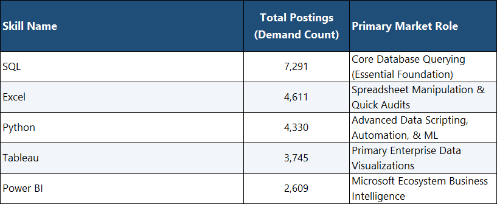
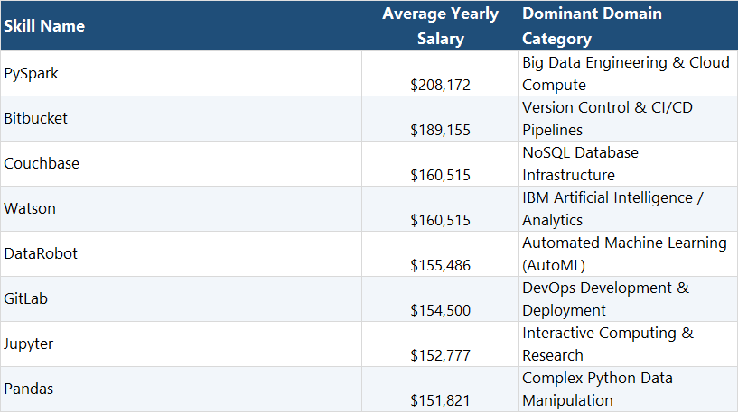
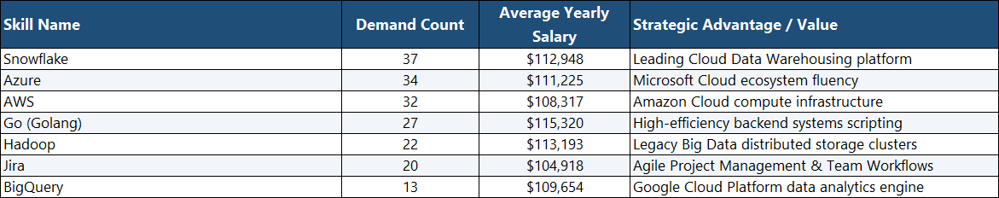

# Introduction
Diving  into the job market as a freshly certified data analyst! Focusing on data analyst roles, this project explores top-paying jobs, associated in-demand skills and where high demand meets high salary in data analytics.

you can check out all the SQL queries [here](/Project_sql/)!
# Background
Driven by the quest to navigate the data analyst job market more effectively, this project was born from a desire to pinpoint top-paid and in-demand skills, streamlining others' work to find optimal jobs.
the data hails from Luke barousse's [SQL Course](https://lukebarousse.com/sql). It is packed with insights on job titles, salaries, locations, and essential skills. 
### The main questions I wanted to answer through sql were:
1. what are the top_paying jobs for data analyst jobs?
2. what are the skills required for these top paying jobs?
3. what are the most in demand skills to learn?
4. what are the top skills based on salary?
5. what are the most optimal skills to learn?
# Tools used
For a deep dive into the data analyst job market, I harnessed the power of sereral key tools:
- **SQL:** the backbone of my analysis, allowing me to query the data and unearth critical insights.
- **PostgreSQL:** The chosen database management system, ideal for handling the job posting data. 
- **Visual Studio Code:** My go-to for database management and executing SQL queries.
- **Git & Github:** Essential for version control and sharing my SQL scripts and analysis, ensuring collaboration and project tracking.
# The Analysis
Each query for this project aimed at investigating special aspects of the data analyst job market. Here is how each question was approached:

### 1. Top Paying Data Analyst Jobs
To identify the highest paying roles, I filtered data analyst positions by average yearly salary and location, focusing on remote jobs. this query highlights the high paying opoportunities in the field.
```sql
SELECT
    job_id,
    job_title,
    job_location,
    job_schedule_type,
    salary_year_avg,
    job_posted_date :: DATE AS posted_date,
    name AS company_name
FROM
    job_postings_fact j
    LEFT JOIN company_dim c ON j.company_id = c.company_id
WHERE
    job_title_short = 'Data Analyst' AND
    job_location = 'Anywhere' AND
    salary_year_avg IS NOT NULL
ORDER BY
    salary_year_avg DESC
LIMIT 10;
```
Here is the breakdown of the top data
🔍 Key Insights
- **Top Earner:** The entry for Data Analyst at Mantys stands out significantly as the highest paying position at an average salary of $\$650,000$.
- **Leadership Roles:** Strategic and executive leadership roles like the Director of Analytics at Meta ($\$336,500$) and Associate Director at AT&T ($\$255,829.50$) represent the upper echelon of data analytics career progression.
- **Principal Positions:** Senior individual contributor roles such as Principal Data Analyst (found at SmartAsset and Motional) command highly competitive salaries ranging from $\$186,000$ to $\$205,000$.
- **Flexibility:** All listed top positions are categorized with a location of Anywhere, indicating that high-compensation analytics roles are largely remote-friendly or flexible.

### Data Viasualization
.png>)
*Bar graph visualizing the salary for the top 10 salaries for data analyst; Gemini generated this graph from my SQL result*

Salary VisualizationA horizontal bar chart titled **"Top Data Analyst Jobs by Average Yearly Salary"** has been generated and saved as top_data_analyst_salaries.png. The chart lists the jobs in ascending order from bottom to top so that the highest paying job (Data Analyst at Mantys) sits prominently at the top, followed by Director of Analytics at Meta. Individual labels clearly state both the role and the company name, along with precise salary markers appended onto the end of each bar for seamless readability.

### 2. Skills required for these top paying jobs
TO understand what skills are required for the top paying jobs, I joined the job postings with the skills data, providing insights into what employers value for high compensation roles.
```sql
WITH top_paying_skills AS (
    SELECT
        job_id,
        job_title,
        salary_year_avg,
        name AS company_name
    FROM
        job_postings_fact j
        LEFT JOIN company_dim c ON j.company_id = c.company_id
    WHERE
        job_title_short = 'Data Analyst' AND
        job_location = 'Anywhere' AND
        salary_year_avg IS NOT NULL
    ORDER BY
        salary_year_avg DESC
    LIMIT 10
)
SELECT 
*
FROM top_paying_skills t
INNER JOIN skills_job_dim s ON t.job_id = s.job_id
INNER JOIN skills_dim d ON s.skill_id = d.skill_id
```
Here is the breakdown of the most demanded skills for the top 10 highest paying data anlyst jobs
- SQL is leading with a bold count of 8.
- python follows closely with a bold count of 7.
- Tableau is also highly sought adter with a bold count of 6. Other skills like R, snowflake, Pandas and Excel show verying degrees of demand.
### Data Visualization
.png>)
*Table generated by Gemini based on my SQL results*

Skills Required for the Top Paying Jobs (Visualization Summary) shows that to break into the extreme upper tier of data analyst salaries (ranging from $\$184,000$ to $\$650,000$), a core foundational tech stack is almost universally required.
- SQL leads the pack, being explicitly required in $8$ out of the $10$ top postings.
- Python follows closely behind with $7$ mentions.Tableau dominates the business intelligence layer with $6$ mentions.
- Advanced statistical processing and enterprise data warehousing roles bring in R ($4$ mentions), Snowflake ($3$ mentions), Excel ($3$ mentions), and Pandas ($3$ mentions).

### 3. In demand skills for Data Analysts.

in a bit to determine the most sought after skills for Data Analysts, an inner join was done connecting the job_posting_fact data set on skills_job_dim and Skills_dim set on skills_job_dim.

```sql
SELECT
    skills,
    job_location as Location,
    COUNT(skills_job_dim.job_id) AS Demand_count
FROM job_postings_fact
INNER JOIN skills_job_dim ON job_postings_fact.job_id = skills_job_dim.job_id
INNER JOIN skills_dim ON skills_job_dim.skill_id = skills_dim.skill_id
WHERE
    job_title_short = 'Data Analyst' AND
    job_location = 'Anywhere'
GROUP BY job_location, skills
ORDER BY Demand_count DESC
LIMIT 5;

select * from skills_job_dim limit 5;
```

When shifting focus from the highest-paying niche postings to the broader job market volume, the skills that appear most frequently across all data analyst job descriptions represent the "core baseline requirement."


### Key Highlights 
**The Non-Negotiable Core:**
  SQL and Excel remain absolute market prerequisites. Together, they represent the foundational data access and spreadsheet tools required for almost all junior-to-mid level analyst positions.

**The Technical Divide:**
   Python and visual analytics platforms (Tableau/Power BI) form the next tier, showing that data visualization and reporting fluency are highly prized across modern business units.

### 4. Skills based on salary.
Exploring the average salaries associated with different skills revealed which skills are the highest paying.


```sql
SELECT
    skills,
    Round(AVG(salary_year_avg), 0) AS avg_salary
FROM job_postings_fact
INNER JOIN skills_job_dim ON job_postings_fact.job_id = skills_job_dim.job_id
INNER JOIN skills_dim ON skills_job_dim.skill_id = skills_dim.skill_id
WHERE
    job_title_short = 'Data Analyst' AND
    job_location = 'Anywhere' AND
    salary_year_avg IS NOT NULL
GROUP BY 
    skills
ORDER BY 
    avg_salary DESC
LIMIT 25;
```
Here is the breakdown fo the results for top paying skills for Data Analysts:
- **High Demand for Big Data & ML Skills:** Top salaries are commanded by analysts skilled in big data technologies, machine learning tools and Python libraries and predictive modelling capabilities.
- **Software Development * Deployment Proficiency:** Knowledge in development and deployment tools(gitlab, airflow) indicate a lucratve crossover between data analysis and engineering, with a premium on skills that facilitates automation and efficient data pipeline management.
- **Cloud Computing Expertise:** Familiarity with cloud and data engineering tools (Elasticsearch, Databricks, GCP) underscores the growing importance of cloud-based analytics environments, suggesting that cloud proficiency significantly boosts earning potential in data analytics. 

### Visualization

*Table of the high compensation premium skills to have*
### Key Highlights:
- **Data Engineering Crossover:**
  The top-paying skills are heavily skewed toward Data Engineering and software development methodologies (e.g., PySpark, Bitbucket, GitLab). Analysts who know how to build stable automation pipelines make significantly more than those doing basic querying.
- **Niche Tooling Premium:**
  Knowing specialized frameworks like Couchbase or enterprise AI suites (Watson, DataRobot) commands a massive salary premium because the talent pool for these tools is highly constrained.

### 5. The most optimal skills to learn

Combining insights from demand and salary data, this query aims to pinpoint skills that are both in high demand and are offering a strategic focus for skill development.

```sql
WITH skills_demand AS (
    SELECT
        s.skill_id,
        s.skills,
        COUNT(sj.job_id) AS Demand_count
    FROM job_postings_fact 
    INNER JOIN skills_job_dim sj ON job_postings_fact.job_id = sj.job_id
    INNER JOIN skills_dim s ON sj.skill_id = s.skill_id
WHERE
    job_title_short = 'Data Analyst' AND
    salary_year_avg IS NOT NULL AND
    job_work_from_home = TRUE
GROUP BY 
    s.skill_id
),
average_salary AS (
SELECT
    sj.skill_id,
    Round(AVG(job_postings_fact.salary_year_avg), 0) AS avg_salary
FROM job_postings_fact
INNER JOIN skills_job_dim sj ON job_postings_fact.job_id = sj.job_id
INNER JOIN skills_dim s ON sj.skill_id = s.skill_id
WHERE
    job_title_short = 'Data Analyst' AND
    job_work_from_home = TRUE AND
    salary_year_avg IS NOT NULL
GROUP BY 
    sj.skill_id
)
SELECT
    skills_demand.skill_id,
    skills_demand.skills,
    Demand_count,
    avg_salary 
FROM
    skills_demand
INNER JOIN average_salary ON skills_demand.skill_id = average_salary.skill_id
WHERE
    Demand_count > 10
ORDER BY
    avg_salary DESC,
    Demand_count DESC
LIMIT 25;
```

The most optimal skills to learn are those that possesses both healthy demand (high job posting security) and a highly competitive above-average salary (financial reward). This serves as the strategic roadmap for career advancement.


*Table of the most optimal skills to learn*
### Key Highlights
**The Cloud Shift:**
 Cloud computing platforms dominate the optimal quadrant (Snowflake, Azure, and AWS). Companies are eager to pay a premium of over $\$110,000$ to analysts who can efficiently operate on modern remote cloud architecture.
 **The Python/R Baseline Note:**
  While languages like Python ($\$101,397$) and R ($\$100,499$) boast intense volume, their average salaries hover slightly lower than Cloud Infrastructure tools. This implies that language literacy is widely available, but managing those languages within cloud systems is where the highest value lies.


# What I learned
Throughout this adventure, I have well charged my SQL toolkit with some serious firepower:
- Complex Query crafting: Mastered the art of advanced SQL, merging libraries like a pro.
- Data Aggregation: cozy with GROUP BY and turn aggregate functions like COUNT() and AVG() into data summerizing sidekicks.
- Analytical Wizardry: Leveled up real world puzzle solving skills. turning questions into actionable insightful SQL queries. 

# Conclusions
### Insights
1. **Top-Paying Data Analyst Jobs**: The highest paying jobs for data analysts that allow remote work offer a wide range of salaries, the highest at $650,000.
2. **Skills for Top Paying Jobs**: High paying data analyst jobs require advanced proficiency in SQL, suggesting it's a critical skill for earning a top salary.
3. **Most In-Demand Skills**: SQL is also the most demanded skill in the data analyst job market, thus making ir essential for job seekers.
4. **Skills with High Salaries**: Specialized skills, such as SVN and Solidarity, are indicating a premium on niche expertise.
5. **Optimal Skills for Job Market Value**: SQL leads in demand and offers for a high average salary positioning it as one of the most optimal skills for the data analysts to learn to maximize their market value.
### Clossing Thoughts
This project enhanced by SQL skills and provided valuable insights from the analysis serve as a guide to prioritizing skill development and job search efforts. Asiring data analystscan better position themselves in a competitive job market by focussing on high demand, high salary skills. This exploration highlights the importance of continuous learning and adaptation to emerging trends in the field of data analytics. 
